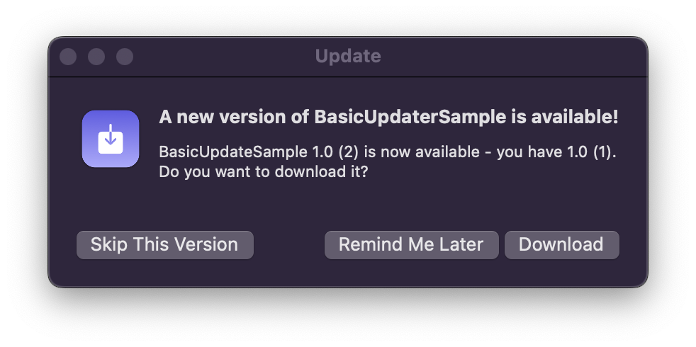

#  ``BasicUpdater``

Prompt users to download updates for you Mac app using GitHub Releases

## Topics

### Updater
Check for updates and prompt the user if one exists

- ``Updater``

- <doc:Creating-the-Updater>
- <doc:Checking-for-Updates>
- <doc:Skipping-Versions>

### GitHub Releases API
Structures for the values returned from the GitHub API

- ``GithubRelease``
- ``GithubAsset``
- ``GithubUser``

