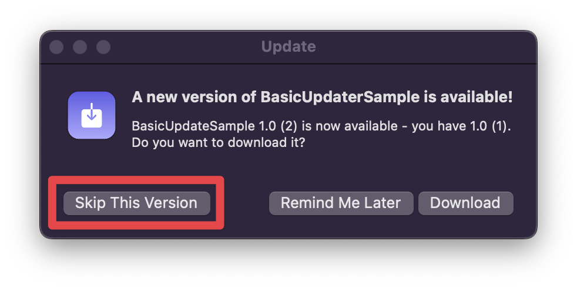

# Skipping Versions
Manage which versions of the app that the user has chosen to ignore 

When presented with a new update, the user can choose to ignore update prompts for that release.

Under-the-hood, this is accomplished by adding the ``GithubRelease/tagName`` to an array of skipped version strings stored in `UserDefaults` with the ``Updater/skippedVersionsKey``. When checking a ``GithubRelease``, the Updater checks if the release is in this array, and if it is, skips it. By default, the array is stored in the `standard` suite, but you can customize which suite to use through the `userDefaultsSuite` argument in the ``Updater/init(projectURL:userDefaultsSuite:autoCheckByDefault:shouldUpdateTo:assetToUse:)`` initalizer. 

To manually add/remove skipped versions, set the ``Updater/skippedVersions`` property.

